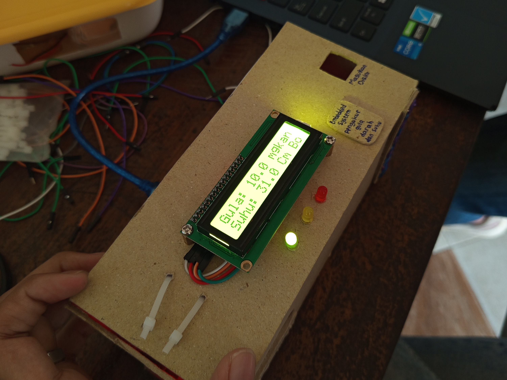
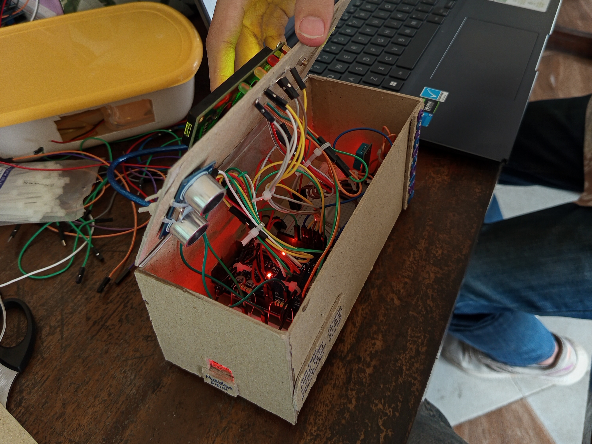

# 🩸 GlucoSense - Alat Deteksi Kadar Gula Darah Non-Invasif

Proyek ini merupakan alat **monitoring gula darah non-invasif** berbasis **Arduino**, menggunakan **sensor photodiode**, **LED merah**, **sensor suhu DHT11**, dan **sensor ultrasonik** untuk mendeteksi keberadaan jari. Hasil deteksi ditampilkan di layar **LCD I2C 16x2**, serta dilengkapi LED indikator dan buzzer sebagai alarm kondisi.

---

## 🚀 Fitur Utama

- 📟 **LCD I2C** menampilkan kadar gula darah dan suhu tubuh.
- 👆 **Sensor ultrasonik** untuk mendeteksi jari pengguna.
- 🔴🟡🟢 **3 LED indikator** untuk menunjukkan status gula darah:
  - 🟢 Rendah / Normal
  - 🟡 Sedikit tinggi
  - 🔴 Tinggi
- 🔔 **Buzzer** berbunyi jika kadar gula melewati batas normal.
- 🌡️ **Sensor DHT11** untuk membaca suhu tubuh.
- 📊 Data ADC dan gula darah juga dikirim ke **Serial Monitor**.
- 🎬 Teks berjalan (running text) saat inisialisasi.

---

## 🧠 Prinsip Kerja

1. Saat jari dimasukkan ke dalam box:
   - Sensor ultrasonik memverifikasi keberadaan jari.
   - Sensor photodiode membaca nilai ADC berdasarkan pantulan cahaya LED merah.
   - Nilai ADC dikalibrasi menjadi kadar gula darah (mg/dL).
   - Suhu tubuh diukur dengan DHT11.

2. Berdasarkan hasil:
   - LCD menampilkan nilai kadar gula & pesan kondisi.
   - LED dan buzzer aktif sesuai level gula:
     - `< 90 mg/dL`: "Gula anda rendah" 🟡 🔔
     - `90-139 mg/dL`: "Gula anda normal" 🟢
     - `≥ 200 mg/dL`: "Gula darah tinggi!" 🔴 🔔🔔

---

## 🔧 Hardware yang Digunakan

| Komponen         | Jumlah | Keterangan                         |
|------------------|--------|-------------------------------------|
| Arduino Uno/Nano | 1      | Mikrokontroler utama               |
| LCD I2C 16x2     | 1      | Tampilan hasil deteksi             |
| DHT11            | 1      | Sensor suhu dan kelembapan         |
| Photodiode       | 1      | Sensor cahaya                      |
| LED Merah 1V     | 2      | Sumber cahaya untuk photodiode     |
| LED Merah, Kuning, Hijau | Masing-masing 1 | Indikator kondisi |
| Buzzer           | 1      | Alarm kondisi berbahaya            |
| Sensor Ultrasonik HC-SR04 | 1 | Deteksi keberadaan jari       |
| Resistor, Kabel, Box Akrilik | Secukupnya | Rangkaian & struktur |

---

## 📦 Instalasi

1. Upload file `.ino` ke Arduino menggunakan **Arduino IDE**.
2. Pastikan pustaka berikut sudah terinstal:
   - `LiquidCrystal_I2C`
   - `DHT sensor library`
3. Rangkai komponen sesuai pin yang ada di kode.

---

## 📌 Pin Konfigurasi

| Fungsi            | Pin Arduino |
|-------------------|-------------|
| DHT11             | D2          |
| Buzzer            | D10         |
| LED Merah         | D9          |
| LED Kuning        | D8          |
| LED Hijau         | D7          |
| LED Power Green   | D12         |
| LED Connect Green | D3          |
| Trigger Ultrasonik| D6          |
| Echo Ultrasonik   | D5          |
| Photodiode        | A0          |
| LCD I2C (SDA/SCL) | A4/A5 (Uno) |

---

## ⚙️ Kalibrasi Gula Darah

Fungsi kalibrasi dapat disesuaikan berdasarkan hasil uji coba:

```cpp
float kalibrasiGula(int adc) {
  return 2.5 * adc - 50;
}
```
Jika nilai terlalu rendah/tinggi, ubah faktor dan offset di atas sesuai hasil eksperimen sensor LED + photodiode.
> *Silakan sesuaikan faktor dan offset berdasarkan sensor & intensitas LED yang kamu gunakan.*

---

## 👨‍🏫 Proyek Tugas Akhir - Embedded System

Proyek ini dikembangkan untuk memenuhi tugas akhir mata kuliah **Embedded System**, dengan fokus pada:

* Integrasi perangkat keras berbasis mikrokontroler.
* Penerapan sensor dan aktuator.
* Pemrosesan sinyal analog ke informasi digital yang bermakna.

---

## 📸 Dokumentasi Proyek

### ⚙️ Prototype Alat


### 🔌 Rangkaian Alat



---

## 👥 Anggota Proyek

Proyek ini dikembangkan oleh mahasiswa dalam kelompok berikut:

- 🧑‍💻 **M. Hibban Ramadhan**
- 🧑‍💻 **M. Sulthon Alfarizky**
- 🧑‍💻 **Radhitya Agrayasa Rhalin**
- 🧑‍💻 **Puan Akeyla Maharani M.**
> **Dosen Pengampu: Ir.Titin Yulianti, S.T., M.Eng.**

---

## 📜 Lisensi

Bebas digunakan untuk keperluan pendidikan, penelitian, dan non-komersial. Silakan cantumkan kredit jika digunakan ulang 🙏

---
